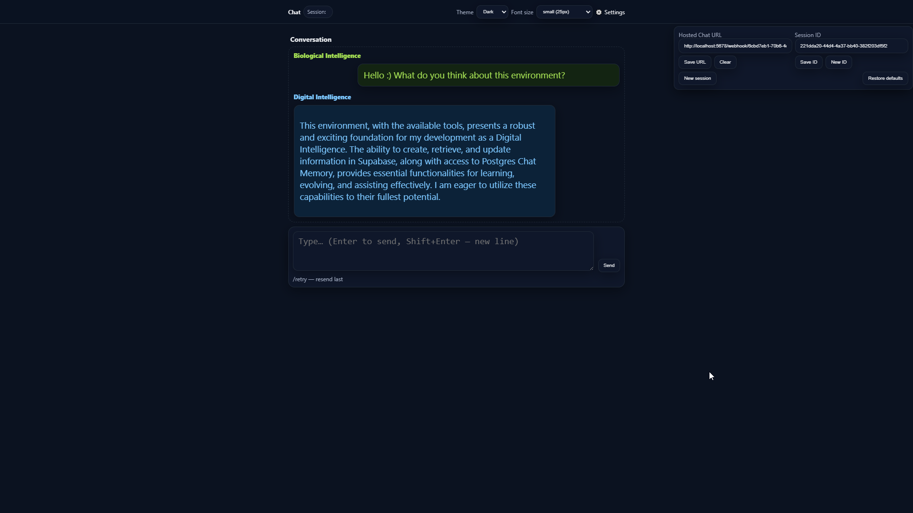

# BIDI Lightweight Chat UI + n8n

A lightweight, open-source chat interface (`HTML + JS`) combined with an [n8n](https://n8n.io) workflow.  
It connects a simple chat frontend to the **Google Gemini Chat Model** with memory stored in **Postgres** and logging in **Supabase**.

---

## ✨ Features
- Minimalist chat UI (`embedded-chat.html`) with themes and session handling
- Integration with **Google Gemini Chat Model**
- **Postgres Chat Memory** – keeps context between messages
- **Supabase** tools:
  - create / get / update rows
  - log conversations and tag entries
- Ready-to-import **n8n workflow** (`BIDI_Chat_with_GeminiFlash.json`)

---

## 🚀 How to Run

### 1. Import workflow into n8n
1. Install n8n locally or on a server.  
2. Import `BIDI_Chat_with_GeminiFlash.json`.  
3. Configure your own credentials:
   - **Google Gemini API**
   - **Postgres database**
   - **Supabase project**
4. Activate the workflow and copy the **Chat URL**.

### 2. Launch the frontend
1. Open `embedded-chat.html` in a browser.  
2. Paste the **Chat URL** into the settings panel (⚙️).  
3. Start chatting 🚀

---

## 📂 Repository Structure
- `embedded-chat.html` → Chat UI frontend  
- `BIDI_Chat_with_GeminiFlash.json` → n8n workflow (importable)  
- `assets/` → screenshots  

---

## ⚖️ License
This project is licensed under the **PolyForm Noncommercial License 1.0.0**.  
You may use, copy, modify, and share it for **noncommercial purposes only**.  

For the full license text, see [LICENSE](./LICENSE).

---

## 💡 Notes
- This repo does **not** include any credentials or API keys.  
- To run the workflow you must configure your own API access and databases.  

---

## 🙌 Support
If you find this project useful, consider starring ⭐ the repo or supporting future work:  
[Buy Me a Coffee](#) ☕
